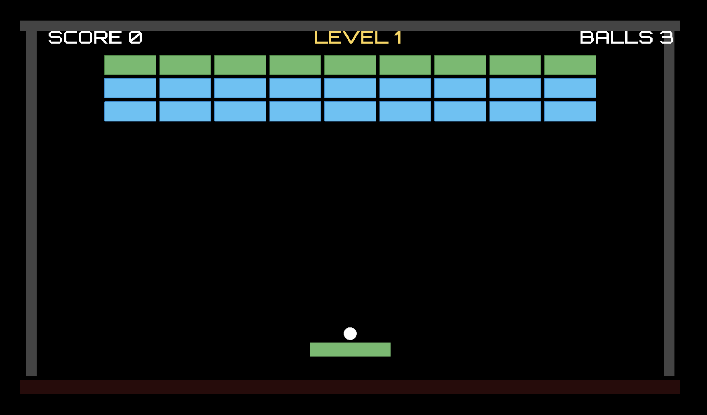
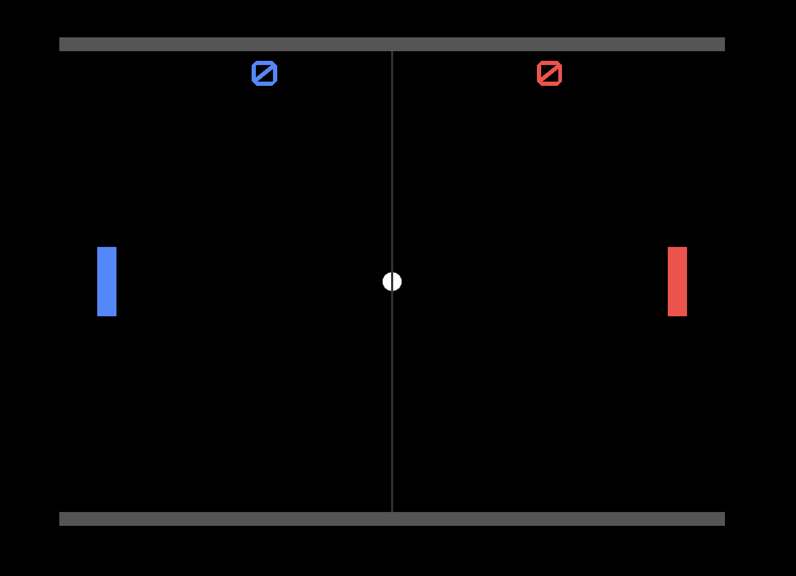
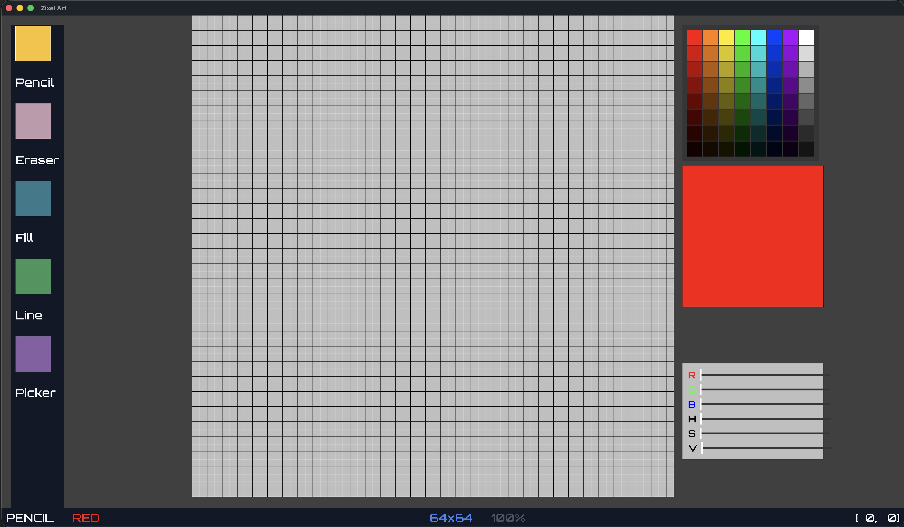

# zig gameEngine

> A learning-first game engine + tooling ecosystem, written in **Zig 0.16**.
> The bet: a teenager should be able to go from *"here is a computer"* to
> *"I made a game"* — with a real engine, a real editor, and a real art tool, not a toy.

A game here is **scene files + templates + a thin `main.zig`**. Gameplay rules
(input, collisions, scoring, screen flow) live in a declarative scene DSL; the
engine runs them. The two demos below were built that way — **Brickles** with
*zero* engine modifications, as the engine's own acceptance test.

<p align="center">
  
  
</p>

<p align="center">
  
</p>

---

## What's in the box

| Piece | What it is |
|---|---|
| **engine** | ECS runtime, systems (physics, collision, movement, render, camera, lifetime), action system, state machine |
| **scene DSL** | Declarative `.scene` / `.template` format — entities, components, input/collision triggers, HUD text bound to state vars |
| **ZixelArt** | A pixel-art editor for making sprites |
| **scene editor** | An editor for scene files |
| **renderer** | Multi-backend GPU renderer — Metal (macOS), Vulkan, OpenGL |
| **platform** | Native windowing/input — macOS (Swift/AppKit), Linux (X11), Windows (Win32) |

~28k lines of Zig across cleanly separated modules (`math`, `platform`,
`renderer`, `ecs`, `action`, `scene-format`, `scene`, `systems`, `engine`), with
an explicit dependency graph in `build.zig` and layered tests.

---

## Quick start

Requires **Zig 0.16.0**. On macOS the build also compiles the Swift platform
layer and Metal shaders for you.

```bash
# Play the demos
zig build brickles      # multi-level breakout (the flagship demo)
zig build pong          # the earlier POC

# Tools
zig build zixelart      # pixel-art editor
zig build sceneEdit     # scene-file editor
zig build ui            # UI playground

# Build everything without running
zig build build-all

# Tests (organized in dependency layers — see build.zig)
zig build test
```

Pick a renderer or optimization mode:

```bash
zig build brickles -Drenderer=metal        # metal | vulkan | opengl
zig build brickles -Doptimize=ReleaseFast  # release build, no debug overhead
```

**Brickles controls:** ← / → move the paddle, **Space** serves/launches and
restarts, **Esc** quits.
**Pong controls:** W/S (left) and ↑/↓ (right), **Space** serves, **Esc** quits.

---

## The scene DSL

This is the heart of the project. Here's the ball from Brickles — a sprite, a
collider, a tag, and a collision trigger that makes it bounce — all data, no code:

```
[Ball:entity]
  [Transform]
    position:vec3 {0.0, -6.0, 0.0}
  [Sprite:circle]
    radius:f32 0.35
    fill_color:color #FFFFFF
  [Collider:circle]
    radius:f32 0.35
  [Tag]
    tags:string "ball"
  [OnCollision]
    [trigger]
      other_tag_pattern:string "wall"
      [action]
        type:string "bounce"
        restitution:f32 1.0
        separate:bool true
```

The paddle moves with held-key input triggers; HUD text binds live to state
variables (`StateText` → `score` / `balls` / `level`); and whole screens
(attract / play / win / lose) are scenes bound to a state machine. The game's
`main.zig` only orchestrates: serve the ball, detect win/lose, build the brick
grid. **All gameplay rules are in the scene data.**

See [`examples/brickles/`](examples/brickles/) for the full breakdown —
including a frank list of [frictions the acceptance test
surfaced](examples/brickles/README.md) (edge-vs-level collision triggers, solid
colliders, declarative template placement) that drive the engine roadmap.

---

## Architecture at a glance

The engine runs a fixed system pipeline each frame:

```
ActionSys → PhysicsSys → MovementSys → CollisionDetectionSys
          → CameraTrackingSys → RenderSys → LifetimeSys
```

- **ECS** — a custom World with type-erased component storage, entity
  generations, and a `query(T1, T2, …)` API.
- **Action system** — input/collision triggers fire actions (`bounce`,
  `set_velocity`, `add_state_int`, `transition_state`, `destroy_self`, …)
  composed from a small set of irreducible primitives.
- **Scene format** — lexer → parser → AST → instantiator, with a component/shape
  registry mapping DSL type names to component constructors.

---

## Status

Early but real. Pong and Brickles are complete, playable games built entirely on
the public API. Brickles proved the core thesis (game = scene files + thin main,
no engine edits) and is multi-level with rising difficulty. Known gaps —
fire-once-on-collision-enter semantics, solid/blocking colliders, declarative
template placement, anchored world-space text — are tracked from the Brickles
acceptance test and shape what's next.

This is primarily a **learning vehicle and long-horizon portfolio piece**; the
architecture and craft *are* the deliverable.
